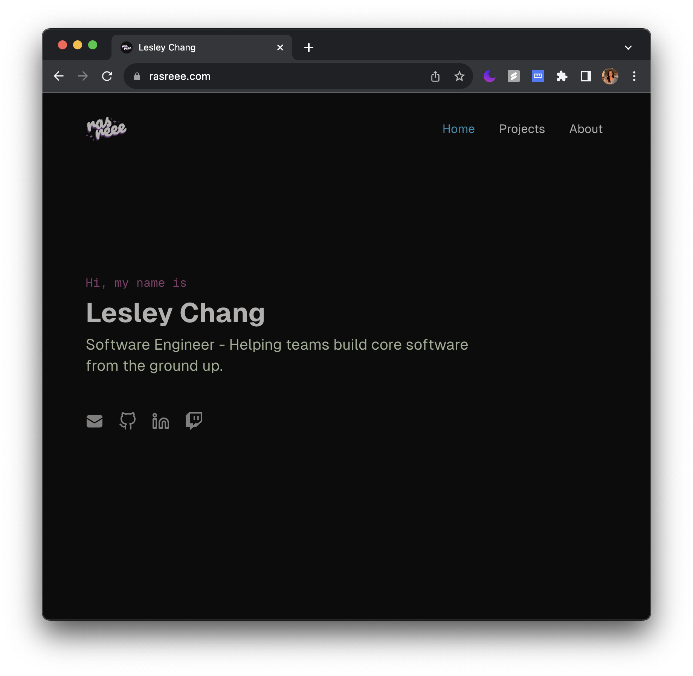

<div align="center">
  <h1>rasreee.com</h1>
  <p>💠 Personal website. Built with Next.js, SCSS, & Tailwind CSS.</p>
</div>



- **Framework**: [Next.js](https://nextjs.org)
- **Database**: [Postgres](https://vercel.com/postgres)
- **Deployment**: [Vercel](https://vercel.com)
- **Styling**: [Tailwind CSS](https://tailwindcss.com)
- **Analytics**: [PostHog Analytics](https://posthog.com)

## Running Locally

This application requires Node.js v18.17+.

Clone the repository.

```bash
git clone https://github.com/rasreee/rasreee.com.git
cd rasreee.com
```

Create the `.env` file and set the required environment variables.

```bash
cp .env.example .env
```

Install dependencies and run the app.

```bash
pnpm install
pnpm dev
```
